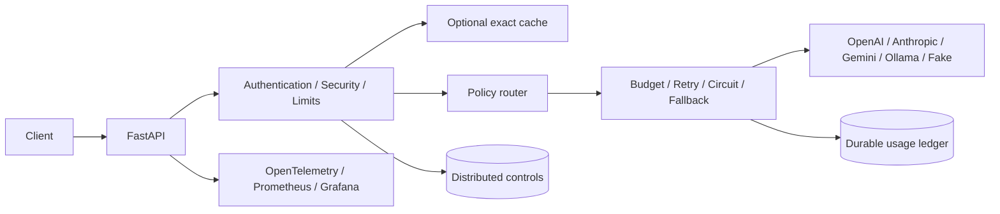

# Production AI Gateway

**One API for reliable, secure and cost-aware access to language models.**

A Python reference implementation with production concerns built into the request path: provider routing, fault tolerance, tenant isolation, spending limits and observable execution.

- OpenAI, Anthropic, Gemini and Ollama adapters, plus a free fake provider.
- Bounded retry, exponential backoff, jitter, shared circuit breakers and fallback.
- Hashed API keys, scopes, expiry, revocation and tenant-aware usage.
- Distributed rate limits, concurrency leases and durable budget reservations.
- Exact caching and idempotency with explicit, limited response retention.
- Structured output validation, basic PII policies and safe telemetry.
- PostgreSQL, Redis, OpenTelemetry, Prometheus, Grafana and Docker Compose.

**Release status:** functional reference MVP. Local and container validation is documented in [the validation report](docs/validation/report.md). Public production deployment still requires the [rollout checklist](docs/operations.md).

## Why this exists

Calling a model is simple. Keeping the integration reliable when providers fail, costs increase or sensitive data appears is harder.

This gateway centralizes those controls so applications can request a task without implementing a different policy for each provider. It is designed for learning, portfolio review and adaptation to a real deployment. It does not claim that regex solves privacy, that retries are free, or that synthetic results prove real model quality.

## Architecture



See [module boundaries](docs/architecture/overview.md), [request sequence](docs/diagrams/request-sequence.md), [failure sequence](docs/diagrams/fallback-sequence.md), [security flow](docs/diagrams/security-flow.md), [system context](docs/diagrams/system-context.md), [containers](docs/diagrams/containers.md) and [deployment](docs/diagrams/deployment.md).

## Quick start

Requirements: Docker with Compose. No paid model account is needed.

```bash
git clone YOUR_REPOSITORY_URL
cd YOUR_REPOSITORY_DIRECTORY
cp .env.example .env
docker compose up --build -d
```

On PowerShell, use Copy-Item .env.example .env instead of cp.

Migrations run automatically. A bootstrap job creates a random demo key with generation and read-only operational scopes. Retrieve it:

```bash
docker compose exec gateway cat /srv/secrets/demo-api-key
```

Set GATEWAY_API_KEY to that value in your shell. Keep it private.

```bash
curl http://localhost:8000/v1/generate \
  -H "Authorization: Bearer $GATEWAY_API_KEY" \
  -H "Content-Type: application/json" \
  -d '{
    "task": "classification",
    "messages": [{"role": "user", "content": "A great service."}],
    "constraints": {
      "quality": "balanced",
      "max_cost_usd": "0.01",
      "max_latency_ms": 5000
    }
  }'
```

For PowerShell:

```powershell
$env:GATEWAY_API_KEY = docker compose exec -T gateway cat /srv/secrets/demo-api-key
$body = @{
  task = "classification"
  messages = @(@{ role = "user"; content = "A great service." })
} | ConvertTo-Json -Depth 5
Invoke-RestMethod -Uri http://localhost:8000/v1/generate -Method Post -ContentType "application/json" -Headers @{ Authorization = "Bearer $env:GATEWAY_API_KEY" } -Body $body
```

The response identifies the provider/model, token usage, estimated cost, routing reason, request/trace IDs and whether fallback or cache was used. FakeProvider returns deterministic fixtures, not general-purpose AI answers.

## Explore the system

| Service | Local address |
|---|---|
| Interactive API documentation | [localhost:8000/docs](http://localhost:8000/docs) |
| Readiness | [localhost:8000/ready](http://localhost:8000/ready) |
| Grafana dashboard | [localhost:3000/d/ai-gateway](http://localhost:3000/d/ai-gateway) |
| Prometheus | [localhost:9090](http://localhost:9090) |
| Jaeger traces | [localhost:16686](http://localhost:16686) |

These services bind to localhost. Anonymous Grafana access and the example database password are for local use only.

## Public API

| Method and route | Purpose |
|---|---|
| POST /v1/generate | Unified generation |
| POST /v1/generate/structured | JSON-schema-validated generation |
| GET /v1/usage | Usage for the authenticated application |
| GET /v1/providers/status | Passive provider circuit state |
| GET /health | Process liveness |
| GET /ready | Required dependency readiness |

Read the [API guide](docs/api.md), [OpenAPI schema](docs/openapi.json) and [Python example](examples/generate.py). API requests cannot provide a tenant identity or widen provider permissions.

## Run tests

```bash
python -m venv .venv
# Activate .venv using your platform's standard command.
pip install -r requirements-dev.lock
pip install --no-deps -e .
ruff check .
ruff format --check .
mypy app
pytest --cov=app
bandit -r app -q
pip-audit -r requirements.lock
```

Tests use temporary SQLite and fakeredis unless real backend URLs are provided. The distributed integration suite requires PostgreSQL and Redis:

```bash
docker compose --profile test run --build --rm tests
```

CI runs lint, format checks, type checks, all test categories, coverage, dependency scanning, secret scanning and a container scan. GitHub execution begins after you push the repository.

## Resilience demo

```bash
make resilience-demo
# Equivalent:
python -m benchmarks.run --experiment resilience --requests 1000
```

Compare baseline, retry, retry plus circuit breaker, and retry plus circuit breaker plus fallback under 30% injected primary-attempt failure probability.

For an HTTP demonstration against the running Compose stack:

```bash
python scripts/compose_chaos.py
```

The script injects a local primary outage, checks fallback and restores the provider in a finally block. It never enables paid providers.

## Cost optimization demo

```bash
make cost-demo
# Equivalent:
python -m benchmarks.run --experiment cost --requests 1000
```

The workload contains 40% classification, 30% summarization, 20% extraction and 10% reasoning. Baseline always uses the strongest fake model. Gateway applies routing and exact caching.

**These are synthetic provider prices and deterministic fixtures.** The ten-case dataset is repeated intentionally, so the cache-friendly result must not be presented as expected production savings. See [methodology](docs/benchmarks.md) and [raw results](benchmarks/results).

### Measured local snapshot

A recorded run used 1,000 requests per strategy. The cost baseline had P95 latency of 83.81 ms; the cache-enabled gateway had P95 latency of 56.84 ms and a 99% cache hit rate. Both passed the deterministic fixture proxy.

Under injected failures, baseline success was 73.2%, retry-only success was 98.1%, and the fallback strategy completed 100% of requests in that run. A circuit without fallback intentionally rejected most requests while open.

These figures describe this synthetic run only. See the [complete measured table](benchmarks/results/README.md), raw JSONL files and [methodology](docs/benchmarks.md).

## Security demo

```bash
make security-demo
# Equivalent:
pytest tests/security -v
```

The suite covers invalid, expired and revoked keys, missing scopes, tenant boundaries, PII handling, prompt heuristics, body limits, safe errors and cache/idempotency isolation.

## Security model

Security policy is derived from the authenticated tenant. Keys are random and only hashes are stored. Prompts are never persisted. Response caching is disabled by default; opting into caching or idempotency stores output temporarily in Redis.

PII detection is a risk-reduction mechanism, not a guarantee of anonymization. Prompt injection cannot be reliably solved by a single classifier or prompt. The gateway does not execute model-generated tools or code.

See the [threat model](docs/security/threat-model.md) and [security policy](SECURITY.md).

## Cost and failure semantics

Each attempt reserves a conservative estimate under a PostgreSQL tenant lock. Retries and fallback consume the same request budget. Known token usage settles the estimate. Unknown attempts remain charged until reviewed.

This prevents a crashed worker from silently releasing potentially billable work. It also means estimates can overstate cost. Provider invoices remain the financial source of truth. Use provider-side limits and reconciliation before production.

Redis and PostgreSQL outages fail closed. Monitoring outages do not authorize bypassing policy. Idempotency reduces duplicate work but does not provide exactly-once execution after Redis data loss.

## Observability

The provisioned dashboard shows throughput, success rate, latency percentiles, token usage, estimated cost, cache hits, retries, fallback and provider errors. Cost panels use rolling windows and are not calendar billing statements.

Traces include request and stage metadata. Logs use structured JSON without prompts, credentials or raw provider errors. Keep metrics and tracing endpoints private in production.

## Design decisions

Seven [ADRs](docs/decisions) explain the modular monolith, PostgreSQL, Redis, provider contract, OpenTelemetry, exact cache and deterministic router.

## Roadmap and limitations

- Validate each external adapter with account-specific models, reviewed pricing and paid smoke tests.
- Add invoice reconciliation, audit export, configurable soft limits and policy administration.
- Evaluate historical routing and richer DLP before adding learned or semantic behavior.
- Add streaming and multimodal contracts only with explicit cost and cancellation semantics.

This release does not include enterprise IAM, billing, RAG, agents, Kubernetes, semantic caching or a custom frontend. The initial availability and overhead SLOs are targets, not production guarantees. Read the [acceptance mapping](docs/acceptance.md) for exact scope.

## Publish to your repository

Extract the package and upload the contents of its ai-gateway folder. Do not upload .env, virtual environments, database files or credentials. The archive already excludes these files.

```bash
git init
git add .
git commit -m "Initial AI gateway reference implementation"
git branch -M main
git remote add origin YOUR_REPOSITORY_URL
git push -u origin main
```

Use those commands for a new, empty repository. For an existing repository, review its history and merge the files through your normal workflow.

## License

[MIT](LICENSE). Contributions are welcome; see [CONTRIBUTING.md](CONTRIBUTING.md).
