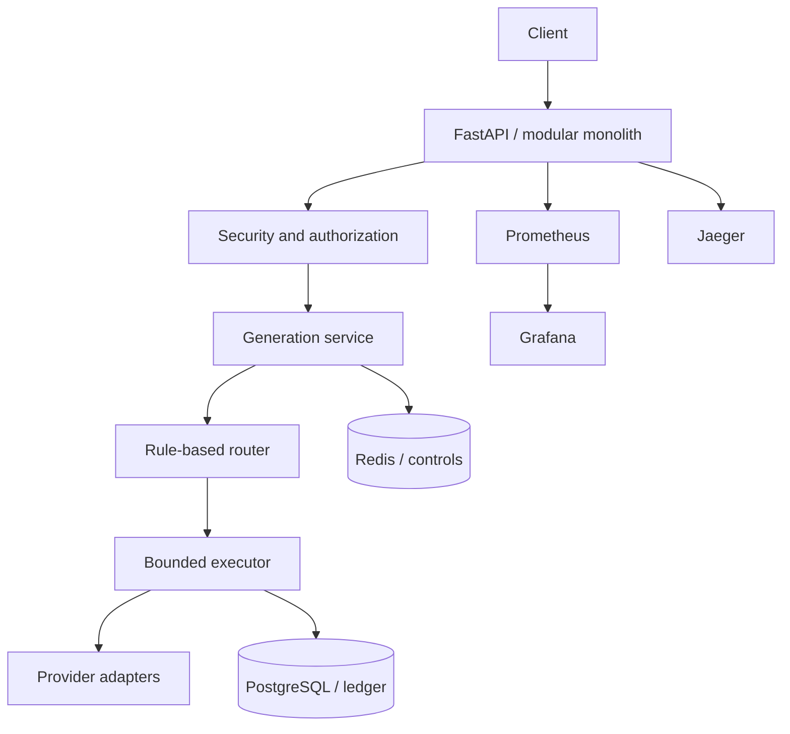

# Container diagram

```mermaid
flowchart TB
    Client --> API[FastAPI / modular monolith]
    API --> Security[Security and authorization]
    Security --> Service[Generation service]
    Service --> Router[Rule-based router]
    Router --> Executor[Bounded executor]
    Executor --> Providers[Provider adapters]
    Service --> Redis[(Redis / controls)]
    Executor --> DB[(PostgreSQL / ledger)]
    API --> Prometheus
    API --> Jaeger
    Prometheus --> Grafana
```
