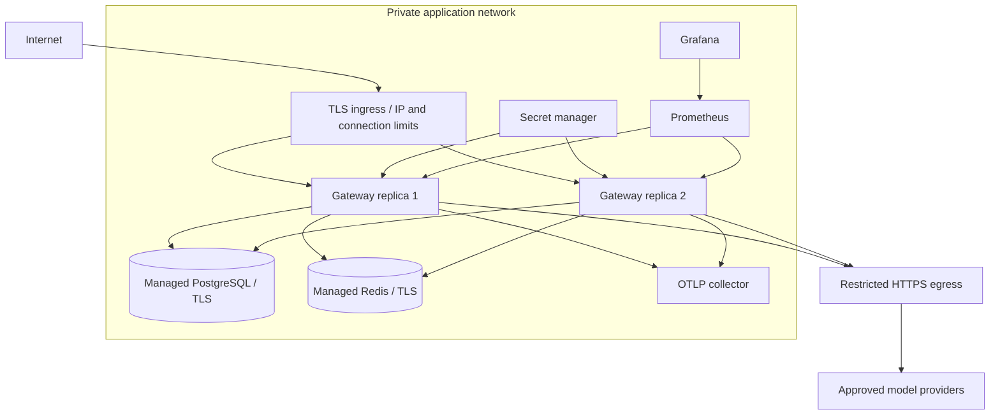

# Deployment diagram

```mermaid
flowchart TB
    Internet --> Ingress[TLS ingress / IP and connection limits]
    subgraph Private application network
        Ingress --> G1[Gateway replica 1]
        Ingress --> G2[Gateway replica 2]
        G1 & G2 --> PG[(Managed PostgreSQL / TLS)]
        G1 & G2 --> RD[(Managed Redis / TLS)]
        Secret[Secret manager] --> G1 & G2
        G1 & G2 --> OTEL[OTLP collector]
        Prom[Prometheus] --> G1 & G2
        Grafana --> Prom
    end
    G1 & G2 --> Egress[Restricted HTTPS egress]
    Egress --> LLM[Approved model providers]
```
