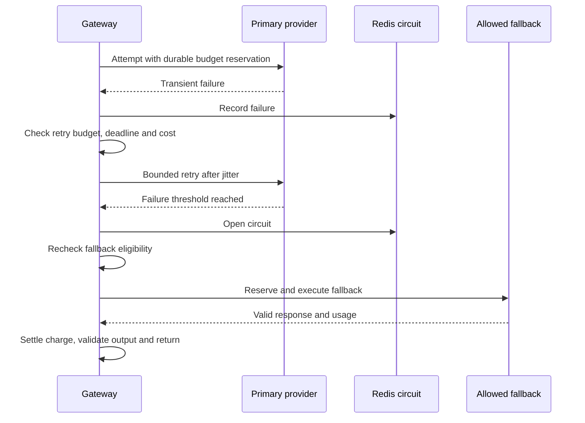

# Failure and fallback sequence

```mermaid
sequenceDiagram
    participant G as Gateway
    participant A as Primary provider
    participant R as Redis circuit
    participant B as Allowed fallback
    G->>A: Attempt with durable budget reservation
    A-->>G: Transient failure
    G->>R: Record failure
    G->>G: Check retry budget, deadline and cost
    G->>A: Bounded retry after jitter
    A-->>G: Failure threshold reached
    G->>R: Open circuit
    G->>G: Recheck fallback eligibility
    G->>B: Reserve and execute fallback
    B-->>G: Valid response and usage
    G->>G: Settle charge, validate output and return
```
