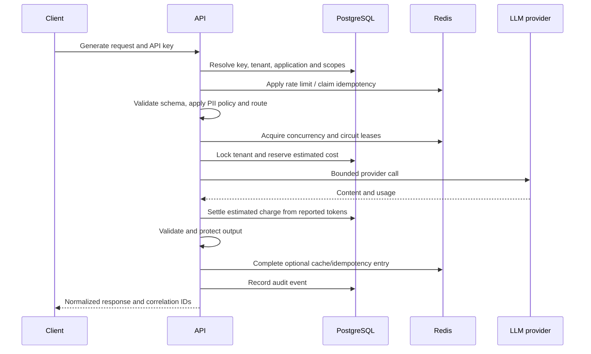

# Request sequence

```mermaid
sequenceDiagram
    participant C as Client
    participant A as API
    participant P as PostgreSQL
    participant R as Redis
    participant L as LLM provider
    C->>A: Generate request and API key
    A->>P: Resolve key, tenant, application and scopes
    A->>R: Apply rate limit / claim idempotency
    A->>A: Validate schema, apply PII policy and route
    A->>R: Acquire concurrency and circuit leases
    A->>P: Lock tenant and reserve estimated cost
    A->>L: Bounded provider call
    L-->>A: Content and usage
    A->>P: Settle estimated charge from reported tokens
    A->>A: Validate and protect output
    A->>R: Complete optional cache/idempotency entry
    A->>P: Record audit event
    A-->>C: Normalized response and correlation IDs
```
