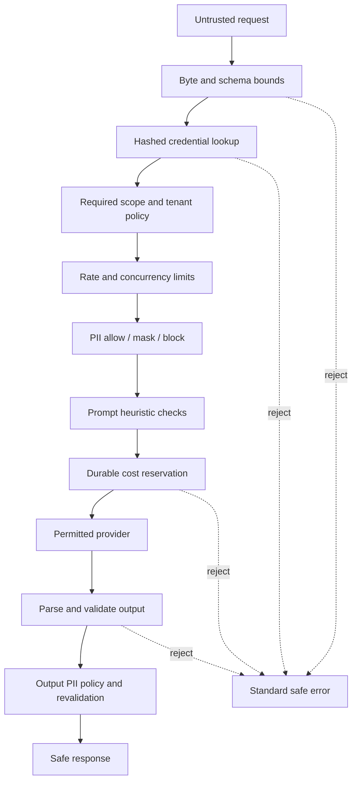

# Security flow

```mermaid
flowchart TD
    Input[Untrusted request] --> Bounds[Byte and schema bounds]
    Bounds --> Auth[Hashed credential lookup]
    Auth --> Scope[Required scope and tenant policy]
    Scope --> Limit[Rate and concurrency limits]
    Limit --> PII[PII allow / mask / block]
    PII --> Injection[Prompt heuristic checks]
    Injection --> Budget[Durable cost reservation]
    Budget --> Provider[Permitted provider]
    Provider --> Output[Parse and validate output]
    Output --> DLP[Output PII policy and revalidation]
    DLP --> Response[Safe response]
    Bounds -. reject .-> Error[Standard safe error]
    Auth -. reject .-> Error
    Budget -. reject .-> Error
    Output -. reject .-> Error
```
